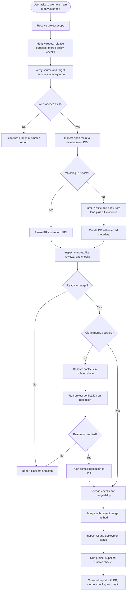

# promote-main-to-development
An operational release skill for promoting a mainline branch into a development
integration branch across one or more repositories. The workflow verifies branch
state, creates or reuses promotion pull requests with inferred titles and
descriptions, performs clean merges, handles conflicts in an isolated clone,
checks CI/CD status, and reports runtime health.

The skill is project-agnostic. Target projects supply the repository set,
release surfaces, deployment providers, health checks, merge policy, and any
project-specific commands.

## Install

The fastest cross-agent install path is the `skills` CLI:

```bash
npx skills add gg-skills/promote-main-to-development
```

Drop this skill into a workspace as a Git submodule for pinned versions, or as a plain clone for latest `main`:

```bash
# Project-local, version-pinned:
git submodule add git@github.com:gg-skills/promote-main-to-development.git .claude/skills/promote-main-to-development

# OR project-local, latest main:
mkdir -p .claude/skills
git -C .claude/skills clone git@github.com:gg-skills/promote-main-to-development.git

# OR user-level, available in every project on this machine:
mkdir -p ~/.claude/skills
git -C ~/.claude/skills clone git@github.com:gg-skills/promote-main-to-development.git
```

Restart your agent or reload skills after installation. See the parent [`skills` catalog repo](https://github.com/gg-skills/skills) for the full catalog.

## When to use

- The user asks to promote `main` or another mainline branch into `development`.
- The promotion includes merge execution, conflict handling, CI/CD inspection, or post-merge runtime verification.
- A single repository, monorepo, multi-repo set, or submodule-aware release surface must be advanced together.
- The operator needs a final closeout report with PR, merge, deployment, and health evidence.

Skip when the task is only to open a handoff PR without merging, when the source
or target branch is not a mainline-to-development promotion, or when required
project-specific deployment details cannot be discovered or supplied.

## How it operates

### Inputs

| Input | Purpose |
|-------|---------|
| Repository topology | Monorepo by default, multi-repo, or submodule-aware |
| Repository set | Repositories promoted together |
| Release surfaces | Apps, packages, workspaces, or deployments affected |
| Source branch | Defaults to `main`; verified remotely before mutation |
| Target branch | Defaults to `development`; verified remotely before mutation |
| Branch preservation | Source and target release branches are permanent and should not be deleted unless explicitly required and authorized |
| PR metadata policy | Optional title/body convention; otherwise inferred from lane, diff, scope, and verification evidence |
| Merge method | Branch-protection-compatible merge mode |
| Deployment providers | CI/CD and hosting surfaces to inspect after merge |
| Runtime checks | Health URLs, smoke tests, aliases, or service checks |
| Conflict policy | Conflicts are resolved only in an isolated clone |

### Outputs

| Output | Description |
|--------|-------------|
| Plain-language progress updates | Explains each step before and after it runs, with what changed and what the user should do next |
| Branch verification report | Confirms source and target branch existence for every repository |
| Promotion PR state | Created or reused PRs with inferred title/body, URL, mergeability, and checks |
| Merge result | Successful target-branch merge or a blocker report with exact failure reason |
| Conflict resolution evidence | Isolated-clone resolution notes, commits, and verification when conflicts occur |
| CI/CD evidence | Check runs, deployment state, and provider-specific status links when available |
| Runtime health report | Project-supplied smoke or health checks after the promotion |
| Link handoff packet | PR, compare, checks, deployment/dashboard, logs, and runtime links when applicable |

### Metadata and handoff behavior

The skill now infers PR metadata by default. A new PR gets a lane-derived title
and a body built from verified evidence: source and target SHAs, changed-file
risk, repository topology, release surfaces, verification plan, and known
unknowns. Use a project-provided title or body pattern only when project docs or
automation require it.

Progress reporting is part of the workflow. Before and after each meaningful
step, the agent explains what it is doing, why it matters, whether it changes
anything, what evidence was found, and what the user should do next. When a PR,
check, deployment, dashboard, log, compare, or runtime URL is discoverable, it
belongs in the handoff packet.

For `main` to `development`, the skill can continue past PR creation into merge
and post-merge verification after readiness gates pass. The final report must
correlate PR state, merge evidence, CI/CD evidence, deployment records, and
runtime health instead of treating a green check as sufficient.

### External commands

The skill uses project-local Git and GitHub CLI commands. Typical surfaces
include:

```bash
git ls-remote --heads <repo-url> main development
gh pr list -B development -H main -R <owner>/<repo> --state open --json number,url,title,body,headRefOid
gh pr create -B development -H main -R <owner>/<repo> --title "<inferred-title>" --body-file <inferred-body-file>
gh pr view <number> -R <owner>/<repo> --json state,mergeable,mergeStateStatus,statusCheckRollup,url
gh pr checks <number> -R <owner>/<repo> --watch=false
gh pr merge <number> -R <owner>/<repo> --merge --delete-branch=false
```

Deployment and runtime commands are intentionally not hard-coded. They must come
from the target project's docs, package scripts, CI/CD provider, or operator
input.

### Side effects

- May create or reuse GitHub pull requests.
- May merge source changes into the `development` branch.
- May create conflict-resolution commits when needed and permitted.
- May trigger CI/CD and deployment workflows through the target branch update.
- Does not force-push or direct-push target branches unless the operator and
  project policy explicitly authorize that mode.
- Does not delete source or target release branches unless project policy explicitly
  requires it and the user authorizes the exact repository and branch.

### Mode toggles

| Mode | Behavior |
|------|----------|
| Discovery-only | Verify repositories, branches, PRs, and unknown project inputs without mutation |
| PR prepare | Create or reuse promotion PRs, then stop before merge |
| Full promotion | Create or reuse PRs, merge when ready, inspect deployments, and report health |
| Conflict resolution | Resolve merge conflicts in an isolated clone, verify, then continue only when safe |

## Operational flow



### Phase map

| Phase | What the agent does | Stop condition |
|-------|---------------------|----------------|
| Scope | Finds repo topology, release surfaces, branch names, and merge policy | Required project inputs are unknown |
| Branch verification | Confirms `main` and `development` exist in every repository | Any branch is missing or ambiguous |
| PR preparation | Reuses an open promotion PR or creates one with inferred title/body metadata | Branches are identical or PR creation fails |
| Readiness gate | Checks mergeability, reviews, status checks, and comments | PR is blocked, failing, or not approved |
| Conflict lane | Uses an isolated clone for conflict resolution and verification | Conflict fix cannot be verified |
| Merge and verify | Merges, inspects CI/deployments, runs supplied health checks | Deployment or runtime health fails |
| Closeout | Reports exact PRs, commits, checks, deployments, and health evidence | None |

### Decision rules

- Explain each meaningful step before and after it happens, using beginner-friendly language.
- Include useful links and a clear next action whenever handing off a PR, deployment, check, or blocker.
- Reuse an existing open PR when the base and head branches match.
- Infer PR title and body from the active lane, changed files, release surfaces, and verification plan before creating a new PR.
- Preserve source and target branches after PR creation or merge; warn the user
  not to click provider branch-deletion prompts for these permanent promotion branches.
- Stop instead of guessing when project-specific deployment commands or health
  endpoints are unknown.
- Treat conflict resolution as a separate verified lane, not as an inline edit
  to the operator's current checkout.
- Do not call the promotion complete until both merge evidence and runtime
  health evidence have been reported.

## Layout

```
.
+-- SKILL.md                         # entry point with full promotion workflow
+-- agents/
|   +-- openai.yaml                  # agent / IDE descriptor
+-- references/
|   +-- main-to-development-reference.md
|                                      # reusable command template and verification contract
+-- assets/                          # skill icons and prompt sources
```

## Quick start

Read [`SKILL.md`](SKILL.md) first. It contains the branch defaults, required
project inputs, topology modes, PR metadata inference rules, plain-language
handoff requirements, useful-link inventory, promotion phases,
conflict-handling policy, and closeout report requirements.

Load [`references/main-to-development-reference.md`](references/main-to-development-reference.md)
when you need the full reusable command template for GitHub PR inspection,
merge execution, CI/CD checks, and runtime health reporting.

## Resources

- [SKILL.md](SKILL.md) - main workflow and safety rules
- [agents/openai.yaml](agents/openai.yaml) - agent / IDE descriptor
- [references/main-to-development-reference.md](references/main-to-development-reference.md) - command template and verification contract
- [assets/](assets/) - skill icons and icon-prompt sources

## Caveats

- When a PR URL is provided, the user should open it, read the description, inspect Files changed, check Checks, and follow the project approval/merge policy.
- When Vercel is relevant, include deployment URLs, dashboard/project links, check links, and logs when they can be discovered.
- Branch names default to `main` and `development`, but both must be verified
  remotely before mutation.
- Deployment and health checks are project-specific. Do not invent provider
  commands, service names, or endpoints.
- Conflict resolution must happen in an isolated clone or equivalent clean
  workspace, not by casually mutating the operator's current checkout.
- New PRs should not have empty descriptions; include inferred scope, diff evidence, verification plan, and unknowns.
- A green PR check is not the same as runtime health. Use the project's defined
  smoke checks before final closeout.
